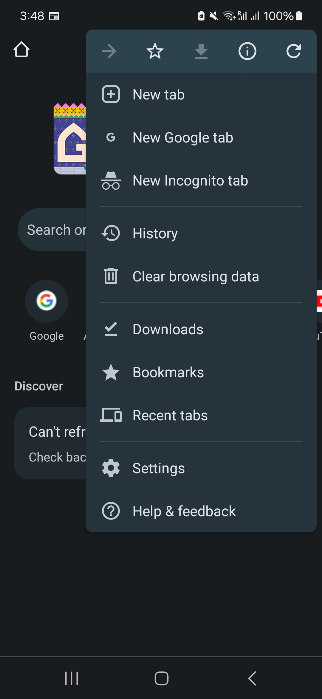
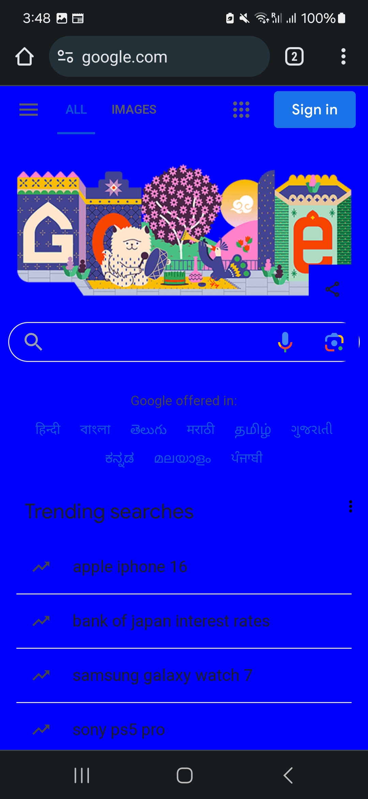

# Chromium Task for Android

This repo is a experimental project for the purpose of interview.

Feature:
Adds new App menu id "New Google tab" for chromium on android.
When the 'New Google tab' menu is selected, a new tab is launched and loaded with "https://www.google.com" with blue background color.

 menu launch 

This repo enables allowing injecting script and the script injection method is used for applying blue background color for the New google tab in
TabObserver.onDidFinishNavigationInPrimaryMainFrame.

Note:
Remember, injecting scripts into webpages without proper authorization may violate the website's terms of service or be considered unethical or illegal. Always ensure you have proper authorization before injecting scripts into webpages. This repo is just for the experimental purpose only.

## System requirements
* A 64-bit Intel machine with at least 8GB of RAM. More than 16GB is highly recommended.
* At least 100GB of free disk space.
* You must have Git and Python v3.8+ installed already (and python3 must point to a Python v3.8+ binary).

## Install build dependencies
* enter repo directory and run `./utils/install-build-deps.sh --android`.

## Building Instructions
* enter repo directory and run `./build.sh`.
  
  Note: build.sh will download depot_tools and chromium sources. And it apply patches from patches folder and then chromium source is built.

## Running
* ~/Android/Sdk/platform-tools/adb install out/Default/apks/ChromePublic.apk
and launch chromium on android
